# Tails-up Cat Rescue

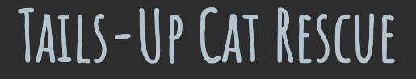

Tails-Up Cat Rescue is a static website for a cat rescue/rehoming centre. The site is aimed at people who are interested in adopting a cat, and showcases a number of cats who need to be re-homed. It provides some key information about the personality, attributes and needs of each cat to enable potential adopters to work out whether they might be a suitable 'match'. It also features a form to put those interested in adopting in touch with the centre, and some further information for those new to cat ownership. The site includes some basic background information about the rescue centre, and links to social media in the footer.

**Link to deployed site:** https://andy-guttridge.github.io/tails-up/

## Features 

### Vertically arranged site

The sections of the main website are arranged vertically in one 'long' webpage, with navigation links pointing to each section within the page, as opposed to separate pages for each section. This was an aesthetic design choice.

### Navigation bar

A 'sticky' navigation bar at the top of the site to enable easy access to each section of the site. The title of the site is also displayed prominently in the navigation bar, and is itself a clickable link to `index.html`. The navigation items are arranged horizontally for screens at least 768px wide, and vertically for screens below this width, to prevent alignment issues.

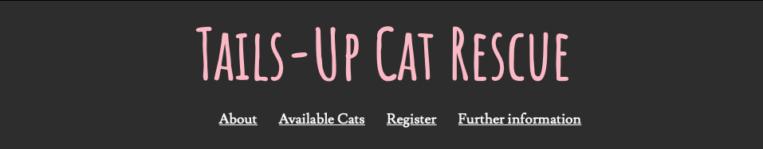 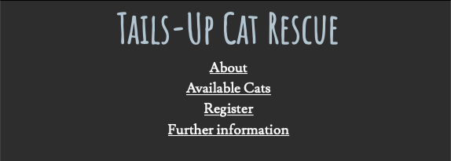

### About section

An 'About' section, which provides some brief background information on the rescue centre and three taglines to explain why Tails-Up Cat Rescue would be a good choice for those looking to adopt a cat. The about section features an eye catching hero image to draw the user in. This is a 'fixed' image for larger screen sizes, providing an interesting scrolling effect as the user moves down the page. This effect was not implemented for screen sizes below 1200px width, because some mobile browsers do not enable this feature.

The information within this section is presented in an 'About Tails-Up' box and a separate 'tagline' box. These are positioned on opposite sides of the hero image for screen sizes of 768px width and above. For screen sizes smaller than this, they are stacked vertically. While this compromises the impact of the hero image for mobile users, the more attractive approach used for larger screens caused the text to be 'bunched' together very tightly on smaller screens. Legibility and usability were prioritised over aesthetics.

The hero image is displayed using the `background-image` CSS property applied to a `
`. Adding `role="img"` and `aria-label` attributes to the `
` to provide context for assistive technology was considered, however this could potentially have obscured the content within the `
` from screen readers. As the hero image itself provides no information and serves no semantic purpose, this was omitted to ensure the content within the `
` remained accessible. 

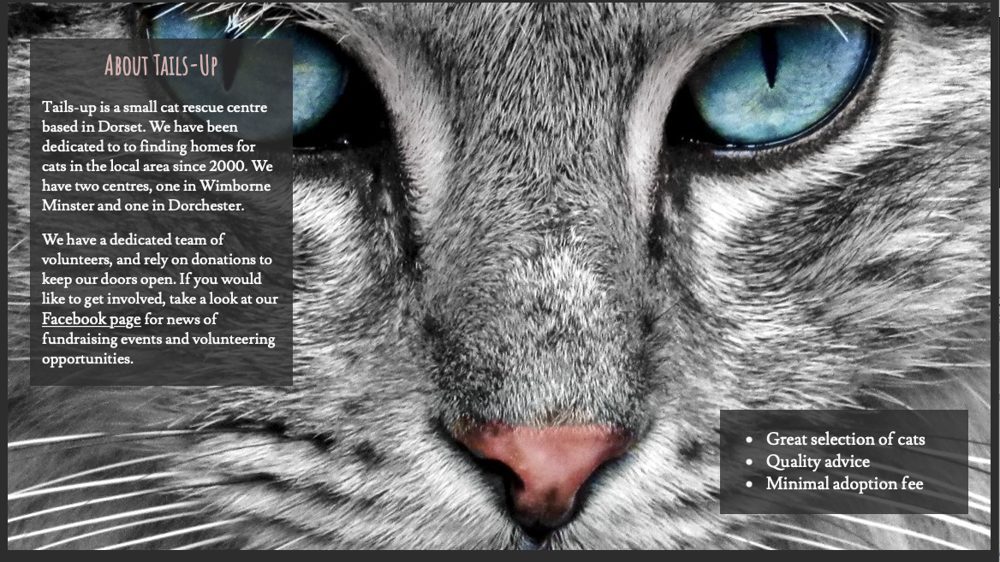 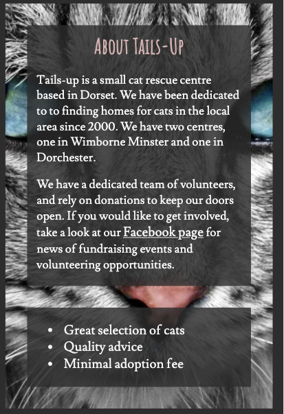

### Available Cats section

An 'Available Cats' section, which features a number of cats currently available for adoption. The name of each cat is provided with a heading, followed by an appealing photo of the cat, a table providing basic details about the cat and a description written in the first 'person'.

The information about each cat is arranged horizontally on screen sizes of 1200px width or more, and stacked vertically on screens narrower than this to avoid some aesthetically displeasing alignment issues and ensure legibility.

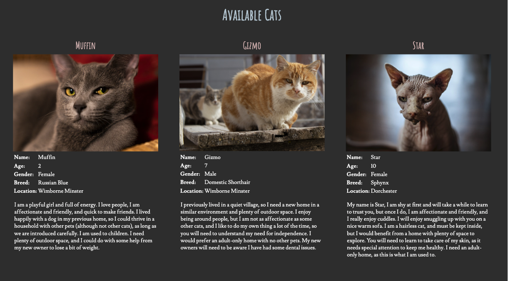 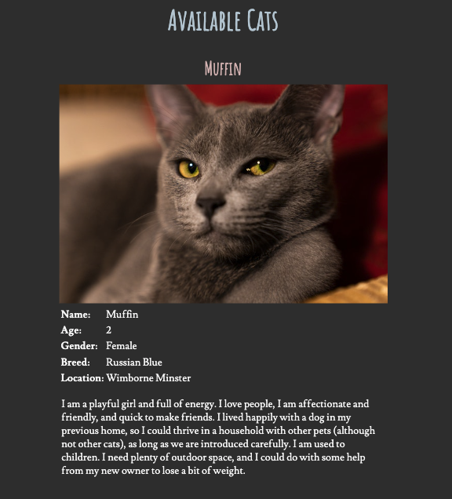

### Register section

A 'Register' section, which provides the user with a form to complete to register their interest in adopting a cat. The form has required text/email fields requesting personal information (first name, last name and email address) and some radio buttons enabling the user to express some basic preferences about the sort of cat they are looking for and information about their home environment. The form also contains an optional field allowing the user to enter the names of any cats currently up for adoption if they are specifically interested in these.

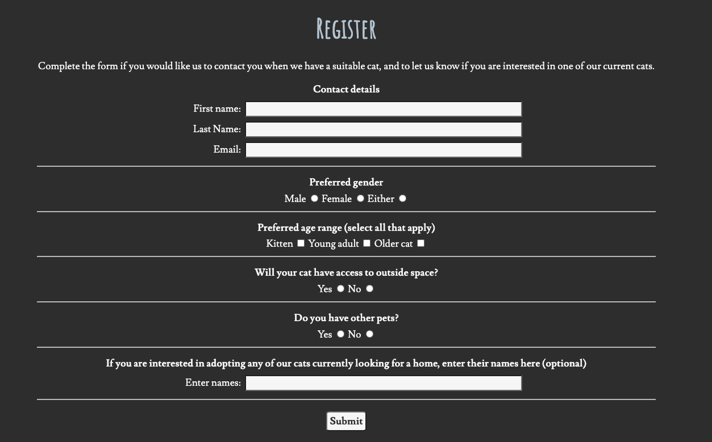

### Page to indicate successful form submission

A separate page opening in a new window to confirm successful submission of the registration form.

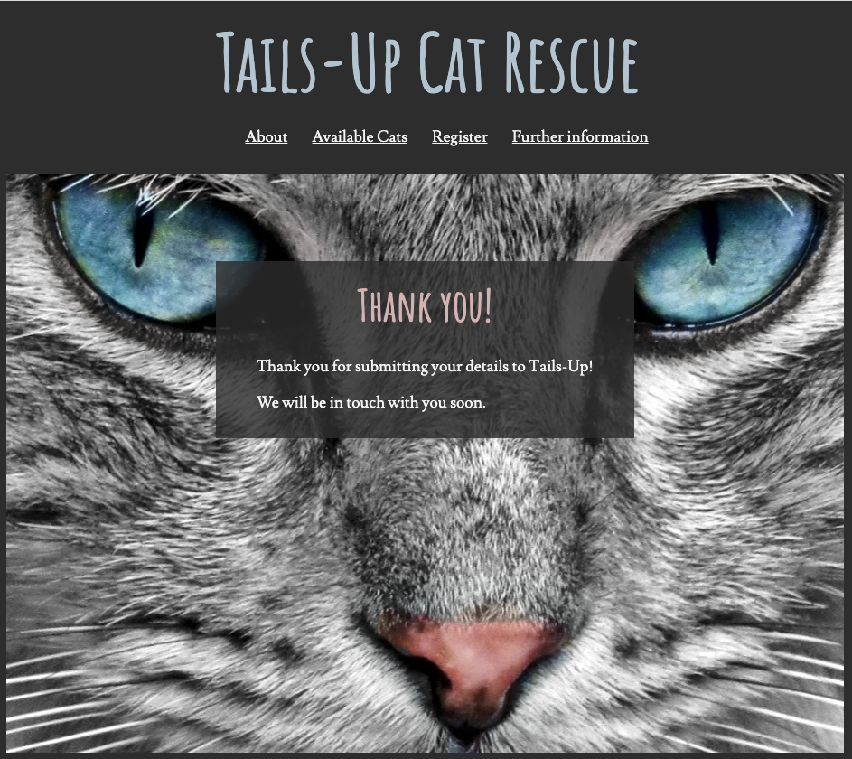

### Further Information section
A 'Further information' section featuring an embedded video from the Cat Society, providing some basic information for those new to adopting a cat, and a link to the Cats Protection charity website.

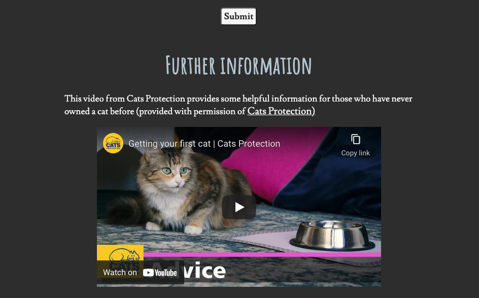

### Footer
A footer with links to social media.

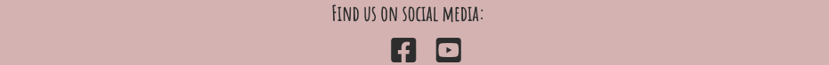

### 404 Error page
A 404 error page to notify the user if they attempt to access a non-existent page or file. This is styled so that it clearly belongs to Tails-Up, and provides the user with links back to the main site.

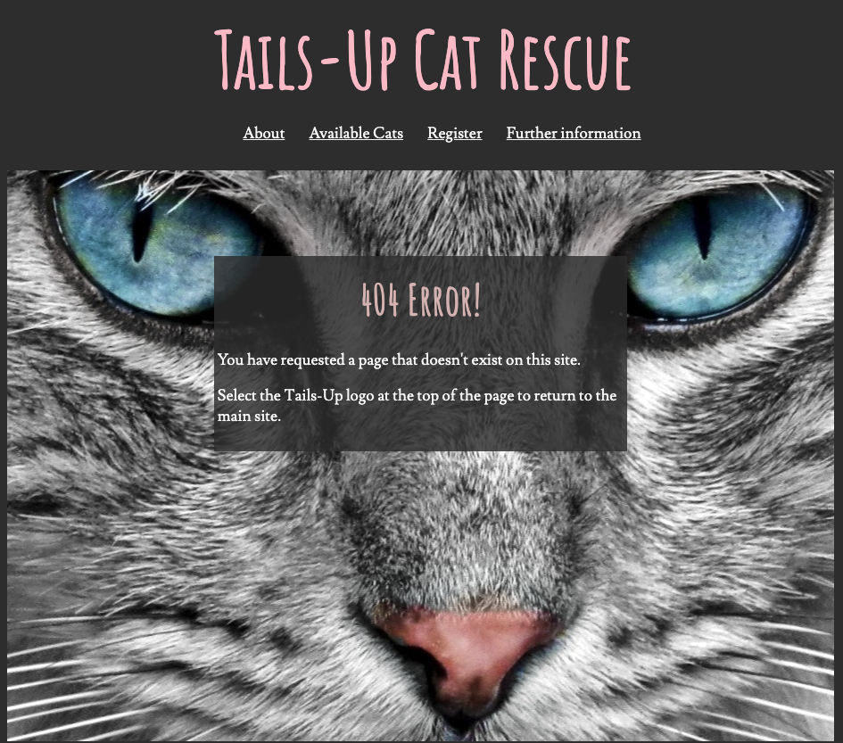

## Design

### Responsiveness
The site features a responsive design providing a suitable layout for smaller screen sizes, while maximising the visual appeal for larger screen sizes. The site has three 'breakpoints':
- For small screens less than 768px wide, the navigation links at the top of the site and all of the content are stacked vertically.
- For medium size screens between 768 - 1199px wide, the navigation links at the top of the site and the content of the 'About' section are displayed side by side, however the details of the cats in the 'Available Cats' section are stacked vertically.
- For screens with a width of 1200px and above, the 'Available Cats' content is also spread horizonatally rather than stacked vertically. This layout also features a 'fixed' hero image, for additional visual appeal. This is not implemented for small and medium screen sizes, as some mobile browsers do not implement a `fixed` value for the CSS `background-attachment` property.

### Planning
The features of the site were 'mocked up' using a basic wireframe of the layout envisioned for larger screens prior to implementation:

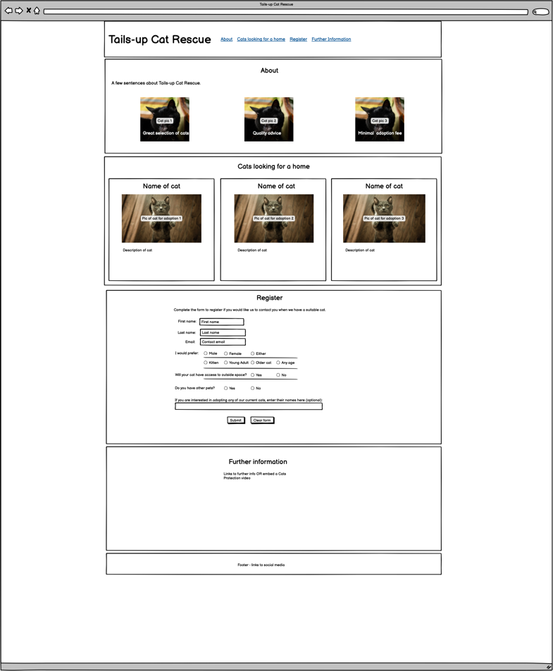

The final site adheres closely to this, however soon after implementation commenced, it was decided to replace the three cat images in the 'About' section with a single 'hero' image. This was a purely aesthetic decision made after browsing some of the cat themed images available for use.

### Colours
The colours for the site were based around the hero image.

- A dark colour from the hero image was chosen as the main site background: `rgb(49, 49, 49)`.
- A light colour from the hero image was chosen as the colour for the main text content: `rgb (247, 247, 247)`.
- Two light colours for headings were chosen, derived from the cat's eyes and nose in the hero image.
    - Blue: `rgb(184, 203, 213)`
    - Pink: `rgb(218, 185, 184)`
- The pink heading colour was also used as the background for the footer, with the background colour from the rest of the site used for the text.
- The standard CSS `pink` colour was used for hovered over links.
- A dark turqouise colour derived from the eyes of the cat in the hero image was used for hovered over links in the footer: `rgb (90, 127, 138)`.

### Fonts
Fonts were sourced from [Google Fonts](https://fonts.google.com/), and [GoVisually](https://govisually.com/blog/2020s-top-20-google-font-pairs-for-your-next-project/) was referenced for ideas for font combinations. After some experimentation, an initial combination of Amatic SC for headings and Josefin Slab for the main text was chosen. Josefin Slab was replaced with Lusitana late in development to enhance legibility, especially on smaller screen sizes. 

### Features Left to Implement

All features initially planned were successfully implemented. 
Ideas for future development could include:

- A facility to enable users to make a donation to the rescue centre.
- A content management system to enable changes to the content (especially the 'Available Cats' section) without having to amend the HTML and CSS code.
- Additional guidance sections, for example on items to purchase for your cat, a cat feeding guide, information on personality traits and understanding cat body language.
- A 'find us' link with an embedded map.

## Testing 

The site was tested regularly throughout development using Google Chrome on Mac OS and Windows 10, and in Safari on Mac OS and on an iPhone XR. This included testing of links, the registration form and the embedded YouTube video. The Google Chrome development tools were used to preview the site on a range of mobile device sizes including Galaxy Fold, iPhone 5S, iPhone XR, Samsung Galaxy A51/71, Pixel 5, iPad, iPad Air and iPad Pro. 

The 'responsive' setting in the development tools was used frequently to freely resize the site through a range of sizes. This helped to decide on the three 'breakpoints' as the best solution to accomodate all screen sizes, and included testing of the site on very wide screens - this revealed that the site started to look quite sparse at large sizes, and resulted in a decision to set a maximum width of 1900px and centre the whole site to ensure a pleasing experience even on very large monitors.

Specific issues found during testing included:

- The use of a sticky header combined with a 'long' page divided into sections meant that while the navigation links to each section functioned correctly, the heading for each section was obscured underneath the header. This was ultimately fixed using the CSS `scroll-margin-top:` property. The first attempt to fix this used `scroll-margin:` on `<section>` elements, however testing the deployed site on a real iPhone exposed a bug causing this property not to work for iOS devices. A Google search found that `scroll-margin-top:` has now been implemented correctly in iOS (source: [https://github.com/mdn/browser-compat-data/issues/7564](https://github.com/mdn/browser-compat-data/issues/7564) ), so this was used instead.
- Testing of the media queries for the responsive design revealed potential issues with content spilling across the hero image for very narrow screen sizes (below about 315px width). This was fixed by slightly increasing the size of the hero image for small screens.
- It was discovered that a value of `fixed` for the CSS `background-attachment:` property is not supported on iOS by testing a deployed version of the site on a real device (the Chrome developer tools do not emulate this behaviour). A value of `scroll` was used in the media queries for small and medium sized devices, to ensure compatibility. This means that only users with a large screen will benefit from a fixed position 'hero' image.
- The site was tested with the VoiceOver screen reader in Mac OS. This revealed that when navigating through the page, only the header, navigation elements, about section and footer were recognised as 'landmarks' by the screen reader. The sections containing the main content of the site were not. Aria-labels were added to each section to rectify this.
- The registration form was initially coded to submit the form to the Code Institute form dump, to test that it was functioning correctly. The form allows the user to make multiple selections for the age range of cats they are interested in, using checkboxes. Testing revealed that multiple selections for the age-range checkboxes were not being displayed on the Code Institute response page - only the first value submitted is shown:

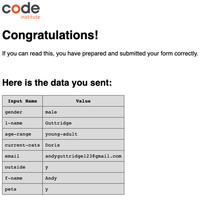

 However, inspecting the data posted by the form in Chrome developer tools demonstrates that the data was being sent correctly, so responding to multiple checkbox values does not appear to be implemented in the form dump. The following screenshot of the Chrome developer tools output demonstrates two values have been successfully submitted for the age-range checkboxes.

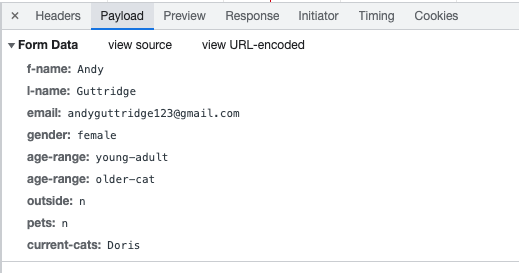

- Once the form was verified to be correctly functioning using the form dump, a separate page to indicate successful submission was created, and the form refactored to link to this page using a `get` value for the `method` attribute of the `<form>` element. This provides a more user friendly experience, and maintains security by ensuring that no user data is actually submitted to any server.

- Testing of the links back to the `index.html` in the header of the 404 error page found that the links were incorrectly formed. This took several attempts to correct, and resulted in a number of GIT commits and pushes to Github, to ensure they would function correctly on the deployed site. 

- Final testing for small screen sizes showed that the user was able to horizontally scroll the page by a few pixels in each direction. By inspecting the elements of the page using the Chrome development tools, it was determined that this was caused by left and right margins on a number of elements including headings and list items, and padding on the `<header>`. CSS was updated to apply margins only to the top and bottom of these elements. This resolved the issue.

- This final testing also demonstrated that one of the checkboxes in the 'Preferred age range' section of the form was pushed onto a new line for screen sizes of around 320px width and below (e.g. iPhone 5), breaking the visual link with the corresponding label:

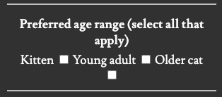

- This was fixed by wrapping each set of checkboxes and labels within two nested `
`s. For mobile displays, the outer `
` is displayed as a block element, causing each checkbox and label pair to display on a new line. The inner `
` enabled the checkbox/label pairs to be appropriately aligned and centred within the outer `
`. While the issue only affected one checkbox, this approach was adopted for all radio buttons and checkboxes in the form for consistency:

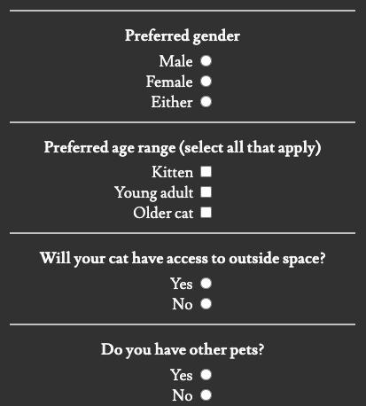

### Validator Testing 

#### W3C HTML Validator
- The W3C HTML validator report contained a warning of a possible mis-use of an `aria-label` on line 52 of `index.html`. The `aria-label` had been included for a `
` element containing 'taglines' for the site in an unordered list, to provide context for assistive technology in the absence of a heading. The `aria-label` was removed from the `
` and added to the nested `<ul>` element instead. This resolved the issue.
- The validator detected a mis-spelling of the `<article>` opening tag on line 136 of `index.html`. Manual inspection revealed that the closing tag on line 166 was also mis-spelled, and the issue was corrected.
- A mal-formed URL in the `action` attribute of the `<form>` element on line 180 of `index.html` was detected and corrected.
- The validator report stated that the `frameborder` attribute on the `<iframe>` element on line 253 of `index.html` is obsolete, and should be replaced with CSS. The code for the `<iframe>` - including the `frameborder` attribute - was derived from the embedded player link provided by YouTube. The offending attribute was removed, and `border: 0px` added to the `styles.css` file to achieve the same effect.
- Once these issues had been addressed, the HTML validation passed with no errors.
- The HTML validator did not produce any warnings or errors for `404.html` or `form-submitted.html`.

#### W3C CSS Validator
- The W3C CSS Validator revealed the use of a `text-align` property with a value of `bottom` on the CSS for the `
` with an id of `#about-text-container`. As `bottom` is not an allowed value for this property, this line of CSS was having no effect and was removed. The CSS validation passed with no errors once this had been addressed.

### Accessibility testing
- The site received a 100% accessibility score in the Google Chrome development tools lighthouse report:

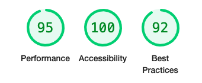

- The WebAIM [contrast checker](https://webaim.org/resources/contrastchecker/) was used to check the colour scheme of the site.
All the text and background combinations included on the site were found to pass the WCAG AAA test (including with the lighter background areas on the semi-transparent boxes in the About section), with the exception of the light pink headings on the dark grey background (and vice-versa in the footer):

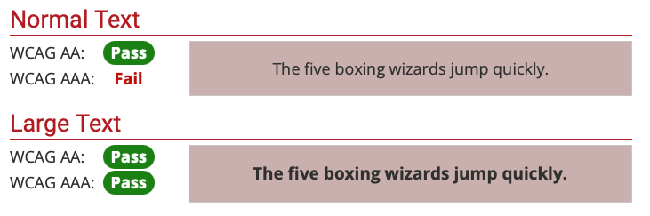

 - The light pink/dark grey combination was found to fail the WCAG AAA test for 'normal' text, however it passed for 'large text'. 'Large text' is defined by WebAIM as 24px or greater. All text using this colour combination on the page is 24px or greater (based on a standard web browser text size of 16px) and the combination still passes the AA test even for normal text, therefore this was deemed acceptable.

### Other testing

- While a high score of 95% for 'performance' was achieved in the lighthouse report for the deployed site as illustrated above, the report identified opportunities to increase performance by serving smaller images, using next generation image formats and delivering critical CSS inline to improve loading times. Image sizes have not been adjusted at this time, in order to provide an aesthetically pleasing experience on larger screens.
- The score of 92% for 'best practice' is acceptable, however a number of of issues were detected with the embedded YouTube video:
    - Use of a deprecated feature was detected in YouTube's JavaScript:

    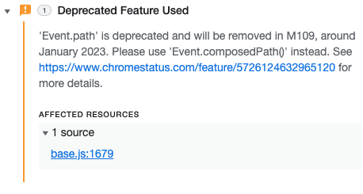

    - An error relating to an event listener in YouTube's JavaScript:

    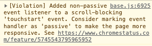

    - A Cross Origin Resource Sharing error relating to the embedded YouTube video. Further details are provided in the 'Unfixed Bugs' section below.

    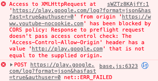

Given these issues all relate to the embedded YouTube video and originate from YouTube's injected code, it is beyond the scope of this project to fix these errors. As the YouTube video was rendered correctly and fully usable throughout testing, and the lighthouse report produce an overall high score for 'best practice', it was decided to retain the video, however this could be revisited in a future version of the site.

- The deployed site was carefully tested against the development version to check that all features function correctly. This included testing of all links within `index.html`, `404.html` and `form_submitted.html`, playing the embedded YouTube video and submitting the registration form. Early deployment and regular testing of a live site throughout development was helpful in picking up some issues that were not apparent when testing only the development version in Google Chrome (specific instances noted above).

### Unfixed Bugs

- During testing, a series of Cross Origin Resource Sharing (CORS) errors relating to the embedded YouTube video were noted in the Chrome developer tools console. In researching this issue, it was noted that the URL of the site embedding the video should be added to the YouTube URL (i.e. `https://www.youtube-nocookie.com/embed/sWZTz8KAjfY?origin=https://andy-guttridge.github.io/tails-up/`), and this was added to the YouTube URL. However, it appears there are currently unresolved issues with the YouTube player causing such CORS errors (source [https://issuetracker.google.com/issues/229013699?pli=1]). Although this issue remains unresolved, the embedded video functioned correctly in testing.

## Deployment

- The site was deployed to GitHub pages as follows: 
  - Select the 'Settings' tab in the GitHub repository
  - Select 'Pages' under the 'Code and automation' heading 
  - Select the 'Main' branch from the 'Source' drop-down menu
  
  The site will then be deployed with a message displayed indicating success and providing the URL of the deployed site.

## Credits 

### Code

- The script for using Font Awesome fonts was provided by [Font Awesome](https://fontawesome.com)
- The advice from the [W3C tutorials on headers](https://www.w3.org/WAI/tutorials/tables/one-header/#table-with-header-cells-in-the-first-column-only) was applied to using table headers vertically in rows instead of using them as column headers
- The technique of wrapping the embedded YouTube video in a `
` to enable responsive sizing of the `<iframe>` element and the CSS to resonsively style the video was taken from [flaviocopes.com](https://flaviocopes.com/responsive-youtube-videos/)
- The code for the `<iframe>` element for the embedded YouTube video was generated by the 'Share -> Embed' option in the YouTube video player
- The code for the Font Awesome social media icons in the footer is based on an example from the [Code Institute Love Running walkthrough project](https://learn.codeinstitute.net/courses/course-v1:CodeInstitute+LR101+2021_T1/courseware/4a07c57382724cfda5834497317f24d5/e6d4cda2bc08458ba94d2092be9bad3a/?child=first)
- The code for importing Google Fonts was adapated from the [Code Institute Coder's Coffeehouse walkthrough project](https://learn.codeinstitute.net/courses/course-v1:CodeInstitute+LR101+2021_T1/courseware/4a07c57382724cfda5834497317f24d5/4d85cd1a2c57485abbd8ccec8c00732c/?child=first)
- Use of the CSS `position` property with a value of `sticky` in conjunction with the `top` property to create a 'sticky' header was based on guidance and the code example at [medium.com](https://elad.medium.com/css-position-sticky-how-it-really-works-54cd01dc2d46) (see under 'How CSS Position Sticky Really Works!' and 'Browser support' headings)
- Media query sizes were adapated from this article at [www.freecodecamp.com](https://www.freecodecamp.org/news/css-media-queries-breakpoints-media-types-standard-resolutions-and-more/)

### Content 

- Placeholder content used during development generated using [Cat Ipsum Generator](https://fungenerators.com/lorem-ipsum/cat/) (not used in final version)

### Media

Images used in the completed website are:
- The large grey cat 'hero' image used in the About section: [Photo by Pixabay from Pexels](https://www.pexels.com/photo/gray-cat-33537/)
- The picture of Muffin the cat is: [Photo by belen  capello from Pexels](https://www.pexels.com/photo/close-up-shot-of-a-russian-gray-cat-8810701/)
- The picture of Gizmo the cat is: [Photo by Gökberk Kılınçarslan from Pexels](https://www.pexels.com/photo/a-ginger-cat-on-wood-10832205/)
- The picture of Star the cat is: [Photo by imustbedead from Pexels](https://www.pexels.com/photo/animal-pet-cute-fur-10813423/)

The images used on the wire frame mock-up of the page and as placeholders during development are:
- [Photo by cottonbro from Pexels](https://www.pexels.com/photo/black-cat-on-green-chair-6853506/
)
-   [Photo by Marko Blazevic from Pexels](https://www.pexels.com/photo/cute-gray-kitten-standing-on-a-wooden-flooring-774731/)

The 'Getting Your First Cat' YouTube video in the 'Further Information' section was embedded with permission of the Cats Protection charity:
- [Getting Your First Cat - Cats Protection](https://www.youtube.com/watch?v=sWZTz8KAjfY)

Thanks to [Adegbenga Adeye](https://ng.linkedin.com/in/adegbenga-adeye-psm-i-14003635?original_referer=https%3A%2F%2Fwww.google.com%2F) for guidance throughout the project.
